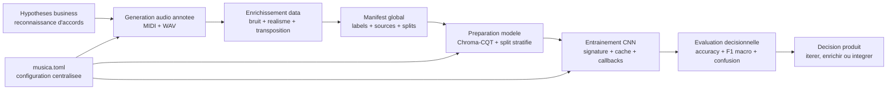

# Musica

Musica est un prototype local d'IA audio pour reconnaitre automatiquement des
accords a partir de fichiers WAV. Le projet repond a un besoin business simple:
reduire le cout de constitution d'un dataset audio annote et fournir une base
mesurable pour des produits musicaux comme l'aide a l'apprentissage, l'indexation
de contenus, la recherche sonore ou l'analyse automatique de performances.

Au lieu de collecter et annoter manuellement des milliers d'extraits, Musica
genere des accords controles, enrichit les donnees par augmentation audio,
trace les labels dans des manifests CSV et entraine un modele CNN de
classification. Le resultat est un pipeline reproductible qui permet a une
equipe produit ou data de passer rapidement d'une idee a une preuve de valeur.

## Valeur business

- Acceleration du prototypage: generation locale de donnees MIDI/WAV annotees
  pour tester une fonctionnalite de reconnaissance d'accords sans attendre une
  campagne d'annotation.
- Reduction du risque data: labels, splits, sources et parametres sont
  explicites dans des manifests et dans `musica.toml`, ce qui facilite les
  audits et les comparaisons entre runs.
- Robustesse produit: bruit, transposition, variations d'instrument, octaves,
  velocites et humanisation simulent des conditions plus proches d'un usage reel.
- Mesure decisionnelle: le notebook expose les volumes de donnees, l'equilibre
  des classes, les courbes d'entrainement, l'accuracy, le F1 macro et la matrice
  de confusion pour juger si le modele merite une iteration ou une integration.
- Capitalisation MLOps: le cache de modele, les signatures de runs et les logs
  rendent les experimentations reproductibles et moins couteuses a relancer.

## Cas d'usage vises

- EdTech musicale: feedback instantane sur les accords joues par un apprenant.
- Outils de composition: detection rapide d'accords pour assister la creation.
- Catalogage audio: enrichissement automatique de bibliotheques sonores.
- Recherche et recommandation: indexation harmonique pour retrouver des passages
  ou comparer des contenus musicaux.
- Validation de faisabilite: estimation du niveau de performance atteignable
  avant d'investir dans un dataset enregistre a grande echelle.

## Livrables du projet

- Une fabrique de dataset audio annote: generation MIDI, rendu WAV, manifests et
  compilation multi-sources.
- Des augmentations pour tester la generalisation: bruit, profils realistes et
  transpositions controlees.
- Un workflow de modelisation: preparation des donnees, extraction Chroma-CQT,
  entrainement CNN, evaluation et prediction.
- Un notebook executif et analytique: lecture des KPI du dataset, du modele et
  d'un exemple de prediction.
- Une CLI `musica` pour automatiser les etapes et les rejouer dans le meme cadre.

## Perimetre actuel

Le prototype couvre 36 classes: les accords `maj`, `min` et `dim` sur les 12
fondamentales. Les donnees peuvent provenir de fichiers synthetiques propres,
de variantes bruitees, de variantes realistes, de transpositions et
d'enregistrements locaux ajoutes dans `audio/chords/recorded/`.

Ce depot n'est pas encore une API produit en production. Il sert de base
mesurable pour valider la qualite du signal, la faisabilite modele et les
investissements data suivants.

## Architecture du projet

Musica est construit comme une chaine de valeur data, pas comme un simple script
d'entrainement. Les choix d'architecture visent a rendre l'experience
reproductible, extensible et mesurable.



- Approche data-first: le projet commence par fabriquer un dataset annote avant
  de chercher a optimiser le modele. Cela reduit le risque de construire une IA
  sans controle sur la qualite et la diversite des donnees.
- Sources combinees: les donnees propres, bruitees, realistes, transposees et
  enregistrees sont traitees comme des sources distinctes puis consolidees dans
  un manifest global. Cette separation permet de mesurer l'effet de chaque type
  de donnees sur la performance.
- Configuration centralisee: les choix de duree, sample rate, ratios de split,
  augmentations, callbacks et chemins sont portes par `musica.toml`. Le projet
  peut donc comparer des runs sans melanger les hypotheses experimentales.
- Pipeline reproductible: chaque run depend d'un seed, d'un split stratifie,
  d'une signature de parametres et d'un cache de modele. L'objectif est de
  savoir quel jeu de donnees et quelle configuration ont produit un resultat.
- Separation des usages: la CLI automatise la construction des donnees, le
  workflow lance l'entrainement complet, et le notebook raconte les indicateurs
  decisionnels. Chaque surface sert un usage different sans dupliquer la logique.
- Evaluation orientee produit: l'architecture ne s'arrete pas a l'accuracy. Elle
  expose aussi le F1 macro, les courbes d'apprentissage, la matrice de confusion
  et une prediction exemple pour relier la performance technique au risque
  utilisateur.

## Architecture neuronale

Le modele utilise une architecture CNN adaptee a la reconnaissance d'accords sur
features Chroma-CQT. Le choix principal est de transformer l'audio en une
representation temps x hauteur, puis de laisser les convolutions apprendre les
motifs harmoniques et temporels.

```mermaid
flowchart LR
    A["WAV audio"] --> B["Extraction Chroma-CQT<br/>temps x 12 hauteurs x 1"]
    B --> C["Normalisation<br/>apprise sur train augmente"]
    C --> D["Conv2D 32<br/>kernel 3x12"]
    D --> E["BatchNorm + ReLU<br/>MaxPool + Dropout 0.10"]
    E --> F["Conv2D 64<br/>kernel 3x3"]
    F --> G["BatchNorm + ReLU<br/>MaxPool + Dropout 0.10"]
    G --> H["Conv2D 64<br/>kernel 3x3"]
    H --> I["BatchNorm + ReLU<br/>MaxPool + Dropout 0.15"]
    I --> J["GlobalAveragePooling2D"]
    J --> K["Dense 128<br/>ReLU + L2 + Dropout 0.25"]
    K --> L["Softmax<br/>36 classes d'accords"]
```



- Entree: tenseur Chroma-CQT de forme temps x 12 classes de hauteur x 1 canal.
  Cette entree met directement en avant la structure musicale utile aux accords.
- Normalisation: une couche de normalisation est adaptee sur le train augmente
  pour stabiliser l'apprentissage sans fuite de donnees vers validation/test.
- Bloc convolutionnel 1: 32 filtres avec noyau `(3, 12)` pour capter des motifs
  temporels courts sur toute la hauteur chromatique.
- Blocs convolutionnels 2 et 3: 64 filtres avec noyaux `(3, 3)` pour apprendre
  des combinaisons locales plus fines entre temps et hauteurs.
- Regularisation: batch normalization, ReLU, max pooling et dropout limitent le
  surapprentissage et favorisent une generalisation plus robuste.
- Aggregation: global average pooling condense les cartes de features sans
  imposer une dependance forte a une position temporelle exacte.
- Classification: couche dense de 128 neurones avec regularisation L2, puis
  sortie softmax sur les 36 classes d'accords.

Cette architecture est volontairement compacte: elle est suffisante pour valider
la faisabilite business, rapide a iterer localement et interpretable dans ses
principaux choix.

## Installation

```bash
uv sync --extra dev
```

FluidSynth est optionnel. Si `fluidsynth` et
`assets/soundfonts/FluidR3_GM.sf2` sont disponibles, le renderer `auto`
l'utilise. Sinon, `generate-wav` retombe sur PrettyMIDI.

## Construire le dataset

La commande `musica` est la surface CLI pour produire les donnees exploitables
par le modele. Les sorties `audio/` restent ignorees par Git pour eviter de
versionner les fichiers generes.

Generer un petit dataset WAV:

```bash
uv run musica generate-wav --output-dir audio/chords/clean --duration 0.5 --max-files 6 --renderer pretty-midi
```

Generer uniquement les MIDI:

```bash
uv run musica generate-midi --output-dir audio/chords/midi
```

Ajouter du bruit:

```bash
uv run musica download-noises --output-dir assets/noises/internet
uv run musica augment-noise --input-dir audio/chords/clean --noise-dir assets/noises/internet --output-dir audio/chords/noisy
```

Creer des variantes realistes:

```bash
uv run musica augment-realistic --input-dir audio/chords/clean --output-dir audio/chords/realistic --variants 2
```

Transposer et relabelliser les accords:

```bash
uv run musica augment-transpose --input-dir audio/chords/clean --output-dir audio/chords/transposed --semitones -5,7
```

Compiler le manifest audio global:

```bash
uv run musica build-manifest --output-path audio/manifest.csv
```

## Evaluer la preuve de valeur

Le notebook `musica.ipynb` est le support recommande pour lire le projet comme
une demonstration business. Il permet de verifier:

- le volume et la couverture des classes;
- l'equilibre train/validation/test;
- la pertinence des features audio Chroma-CQT;
- la convergence du modele;
- les metriques finales et les erreurs par classe;
- la prediction sur un fichier exemple configure.

Pour lancer le workflow complet hors notebook:

```bash
uv run python main.py
```

Pour afficher l'aide du workflow:

```bash
uv run python main.py --help
```

## Tests

```bash
uv run pytest
```

Les tests couvrent la generation MIDI/WAV, les manifests audio, les
augmentations, la surface CLI audio et le workflow de modelisation.
