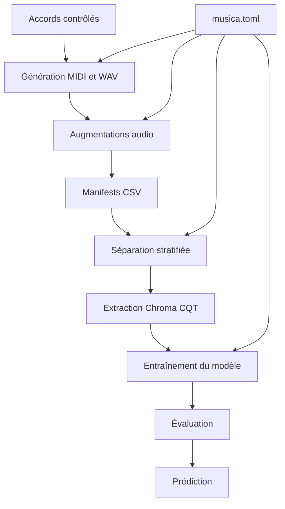
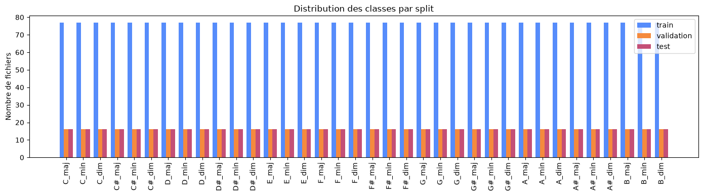
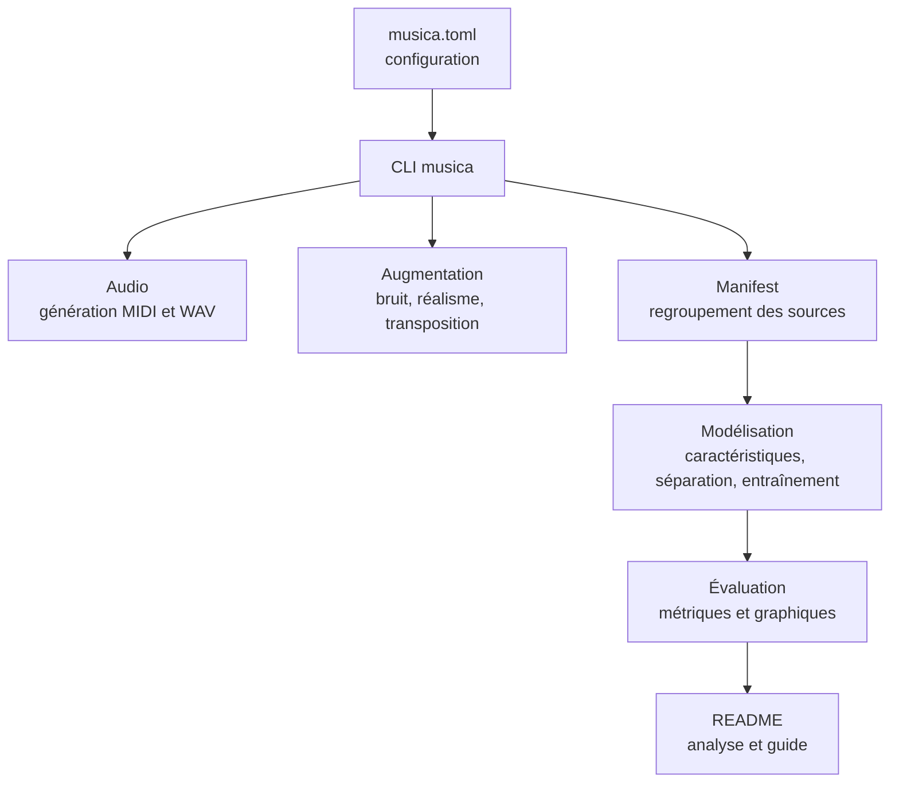
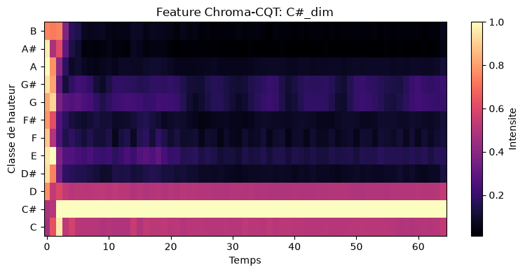
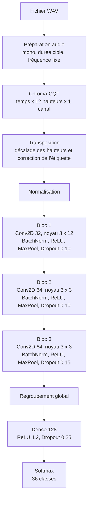
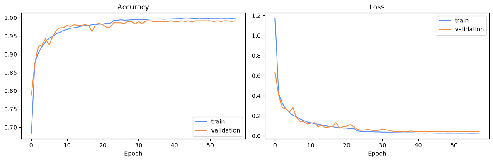
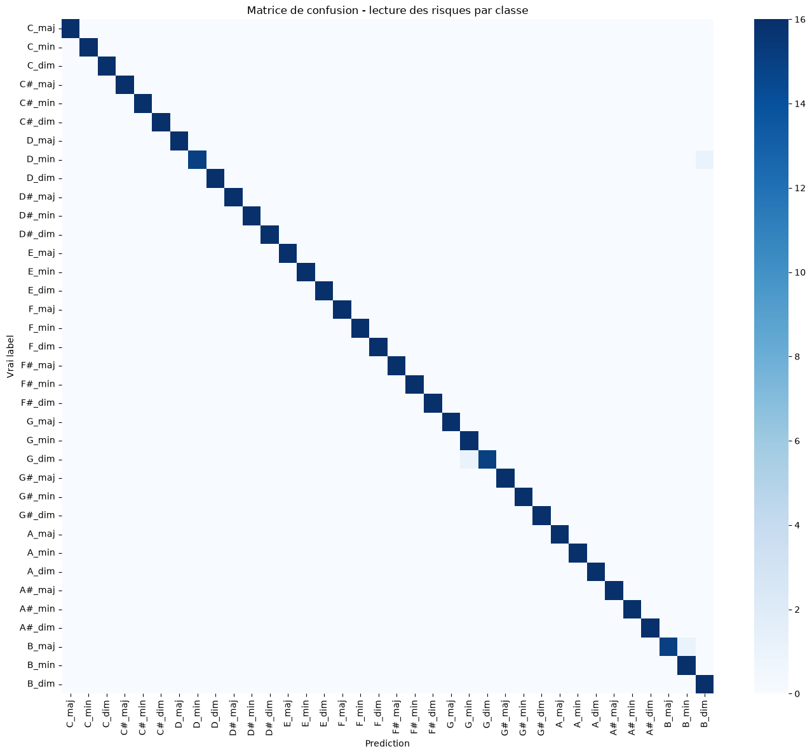

# Musica

Musica est un projet d’intelligence artificielle appliquée à l’audio. L’objectif
est de reconnaître automatiquement des accords à partir de fichiers WAV courts.
Le projet couvre toute la chaîne de travail : création du jeu de données,
augmentation audio, extraction de caractéristiques musicales, entraînement d’un
modèle de classification et analyse des résultats.

Ce document sert de guide pour comprendre le projet, sa méthode, son jeu de
données, son architecture, ses résultats d’essai et ses limites actuelles.

## Sommaire

* [Objectif](#objectif)
* [Méthode générale](#méthode-générale)
* [Jeu de données](#jeu-de-données)
* [Architecture logicielle](#architecture-logicielle)
* [Architecture du modèle](#architecture-du-modèle)
* [Résultats d’essai](#résultats-dessai)
* [Problèmes rencontrés](#problèmes-rencontrés)
* [Installation et commandes](#installation-et-commandes)
* [Limites et améliorations possibles](#limites-et-améliorations-possibles)

## Objectif

Le problème traité est la classification automatique d’accords musicaux. À partir
d’un fichier audio contenant un accord isolé, le système doit prédire la classe
correspondante, par exemple C_maj, A_min ou F#_dim.

Les objectifs du projet étaient les suivants :

* construire une chaîne complète d’apprentissage automatique audio, depuis la
  donnée brute jusqu’à la prédiction ;
* générer un jeu de données annoté sans dépendre d’une annotation manuelle
  lourde ;
* entraîner un modèle capable de reconnaître les accords à partir de
  caractéristiques audio ;
* garder les essais reproductibles avec une configuration centralisée, des
  manifests, des séparations stables, un cache de modèle et des tests
  automatisés ;
* documenter les choix techniques, les limites et les problèmes rencontrés.

Le prototype reconnaît actuellement 36 classes : les accords majeurs, mineurs et
diminués sur les 12 fondamentales chromatiques.

## Méthode générale

Un modèle de reconnaissance d’accords a besoin de nombreux exemples audio
correctement étiquetés. Comme l’enregistrement et l’annotation manuelle sont
longs, Musica part d’accords générés localement. Les étiquettes sont connues dès
la génération, puis le projet ajoute plusieurs variations pour rendre les données
moins artificielles.

Les principales variations utilisées sont :

* plusieurs instruments ;
* plusieurs octaves ;
* plusieurs vélocités ;
* bruit ajouté ;
* effets audio réalistes ;
* transposition avec mise à jour des étiquettes.

La chaîne de traitement suit ces étapes :

1. Générer des accords MIDI ou WAV avec des étiquettes contrôlées.
2. Enrichir les fichiers propres avec du bruit, des effets réalistes et des
   transpositions.
3. Regrouper les différentes sources audio dans des manifests CSV.
4. Créer une séparation stratifiée entre entraînement, validation et test.
5. Transformer chaque fichier audio en représentation Chroma CQT.
6. Entraîner le modèle CNN sur ces caractéristiques.
7. Évaluer le modèle avec la perte, l’exactitude, le F1 macro et un rapport de
   classification.
8. Produire des prédictions sur un fichier audio exemple.



Le fichier musica.toml centralise les paramètres importants :

* chemins des données et des artefacts ;
* durée audio cible ;
* fréquence d’échantillonnage ;
* ratios de séparation ;
* hyperparamètres du modèle ;
* mécanismes d’arrêt ;
* options d’augmentation.

## Jeu de données

Le jeu de données est organisé dans le dossier audio/chords. Il peut contenir :

* des accords générés proprement ;
* des accords bruités ;
* des variantes plus réalistes ;
* des accords transposés ;
* des enregistrements locaux ajoutés manuellement.

Les classes sont construites avec :

* 12 fondamentales, de C à B ;
* 3 qualités d’accord : majeur, mineur et diminué ;
* 36 classes au total.

Lors de nos essais, nous avons utilisé environ 3 900 fichiers WAV. Ce nombre
n’est pas une valeur fixe du projet : il dépend des fichiers générés, des
augmentations lancées et des données locales disponibles.

La répartition utilisée pendant ces essais était la suivante :

| Séparation | Rôle | Proportion utilisée lors des essais |
| --- | --- | --- |
| Entraînement | Apprendre les motifs audio associés aux accords | environ 70,6 % |
| Validation | Suivre la généralisation pendant l’entraînement | environ 14,7 % |
| Test | Évaluer le modèle sur des fichiers non utilisés pendant l’apprentissage | environ 14,7 % |

<p align="center">
  
</p>

La distribution des classes permet de vérifier que les accords restent équilibrés
entre entraînement, validation et test pendant les essais.

Les enregistrements externes, les fichiers WAV synthétisés et la SoundFont SF2
ne sont pas inclus dans le dépôt, car ils sont trop lourds pour être versionnés.
Le code garde les chemins attendus, mais ces fichiers doivent être téléchargés ou
générés localement.

Jeux de données externes utiles :

* GuitarSet : [page officielle](https://guitarset.weebly.com/) et [téléchargement Zenodo](https://zenodo.org/records/3371780) ;
* MusicNet : [téléchargement Zenodo](https://zenodo.org/records/5120004).

## Architecture logicielle

Le projet est structuré comme un package Python. Les responsabilités sont
séparées pour éviter de mélanger génération des données, augmentation,
modélisation et exécution des commandes.



Les principales parties du code sont :

* audio : génération MIDI et WAV, rendu audio et manifests ;
* augmentation : bruit, réalisme audio et transposition ;
* modélisation : configuration, découverte du jeu de données, séparations,
  extraction Chroma CQT, entraînement, évaluation et prédiction ;
* ligne de commande : automatisation des étapes de construction du jeu de
  données ;
* tests : vérification de la génération audio, des manifests, des augmentations,
  de la ligne de commande et du scénario de modélisation.

## Architecture du modèle

Le modèle utilise des caractéristiques Chroma CQT extraites avec librosa. Chaque
audio est chargé en mono à une fréquence d’échantillonnage fixe, coupé ou
complété pour obtenir une durée cible, puis transformé en tenseur temps, hauteur
chromatique et canal. La dimension chromatique contient 12 valeurs, une pour
chaque classe de hauteur.

<p align="center">
  
</p>

Avant l’apprentissage, les exemples d’entraînement sont augmentés par
transposition. Le tenseur Chroma CQT est décalé sur l’axe des hauteurs et
l’étiquette est recalculée pour garder la bonne fondamentale. Cette augmentation
permet au modèle d’apprendre les mêmes relations harmoniques dans plusieurs
tonalités.

### Détail des couches

| Étape | Détail | Rôle |
| --- | --- | --- |
| Entrée | Chroma CQT temps, 12 hauteurs, 1 canal | Représenter l’accord sous forme exploitable par le CNN |
| Normalisation | Adaptée sur l’entraînement augmenté | Stabiliser les valeurs d’entrée |
| Convolution 1 | 32 filtres, noyau 3 x 12 | Observer toute la hauteur chromatique sur une courte fenêtre temporelle |
| Bloc 1 | BatchNorm, ReLU, MaxPool, dropout 0,10 | Stabiliser, activer, réduire et régulariser |
| Convolution 2 | 64 filtres, noyau 3 x 3 | Apprendre des motifs locaux entre temps et hauteurs |
| Bloc 2 | BatchNorm, ReLU, MaxPool, dropout 0,10 | Continuer l’extraction de motifs |
| Convolution 3 | 64 filtres, noyau 3 x 3 | Raffiner les motifs appris |
| Bloc 3 | BatchNorm, ReLU, MaxPool, dropout 0,15 | Réduire le surapprentissage |
| Regroupement global | Moyenne globale des cartes | Résumer les motifs sans dépendre d’une position exacte |
| Couche dense | 128 neurones, ReLU, régularisation L2 | Préparer la décision finale |
| Dropout final | Taux 0,25 | Réduire le surapprentissage |
| Sortie | Softmax sur 36 classes | Produire une probabilité par classe d’accord |



Le modèle est entraîné avec Adam, une perte de classification multi-classe et
l’exactitude comme métrique principale. Des mécanismes d’arrêt anticipé, de
réduction du taux d’apprentissage et de sauvegarde du meilleur modèle sont
utilisés pendant l’entraînement.

## Résultats d’essai

Le projet sauvegarde les artefacts nécessaires pour comparer les expériences :

* modèle entraîné ;
* paramètres de l’exécution ;
* historique d’entraînement ;
* signature calculée à partir du jeu de données et de la configuration.

Cette signature n’est pas écrite en dur dans le README, car elle dépend des
données et des paramètres du moment. Si le jeu de données, les séparations ou les
hyperparamètres changent, une nouvelle signature peut être produite.

Les métriques suivies sont :

* perte d’entraînement ;
* exactitude d’entraînement ;
* perte de validation ;
* exactitude de validation ;
* perte de test ;
* exactitude de test ;
* F1 macro ;
* rapport de classification.

<p align="center">
  
</p>

Les courbes d’entraînement montrent que l’exactitude augmente et que la perte
diminue sur l’entraînement comme sur la validation. Elles servent à repérer un
éventuel surapprentissage ou un problème de convergence.

<p align="center">
  
</p>

La matrice de confusion permet de voir quelles classes sont bien reconnues et
quelles classes risquent d’être confondues. Une diagonale marquée indique que le
modèle prédit majoritairement la bonne classe pendant l’essai représenté.

Les métriques exactes de test ne sont pas recopiées ici afin d’éviter de figer un
résultat qui pourrait ne plus correspondre au dernier état du jeu de données. Il
faut relancer le scénario d’exécution pour obtenir les valeurs correspondant à
l’état actuel du projet.

## Problèmes rencontrés

Les principaux problèmes rencontrés sont les suivants :

1. Annotation des données : un vrai jeu de données audio annoté aurait demandé
   beaucoup de temps à constituer. La génération contrôlée a permis d’avancer
   plus vite tout en gardant des étiquettes fiables.
2. Réalisme du son : des accords parfaitement propres sont trop éloignés de
   conditions réelles. Le projet ajoute donc du bruit, des effets, plusieurs
   instruments, des octaves différentes, des vélocités variables et une légère
   humanisation.
3. Étiquettes après transposition : quand un fichier audio est transposé, la
   fondamentale change. Le projet doit donc recalculer l’étiquette correctement.
4. Reproductibilité : les résultats deviennent difficiles à comparer si les
   données, les séparations ou les paramètres changent sans trace. Les manifests,
   les graines aléatoires, les signatures d’exécution et les paramètres
   sauvegardés répondent à ce besoin.
5. Dépendances audio : la génération audio dépend parfois de composants externes
   comme FluidSynth et une SoundFont. Le projet prévoit donc un rendu automatique
   capable de revenir à PrettyMIDI si FluidSynth n’est pas disponible.

## Installation et commandes

Installer les dépendances :

```bash
uv sync --extra dev
```

FluidSynth est optionnel. Si FluidSynth et la SoundFont
assets/soundfonts/FluidR3_GM.sf2 sont disponibles, le rendu automatique les
utilise. Sinon, la génération WAV peut passer par PrettyMIDI.

1. Générer des WAV propres :

```bash
uv run musica generate-wav --output-dir audio/chords/clean
```

2. Télécharger des bruits et créer des variantes bruitées :

```bash
uv run musica download-noises --output-dir assets/noises/internet
uv run musica augment-noise --input-dir audio/chords/clean --noise-dir assets/noises/internet --output-dir audio/chords/noisy
```

3. Créer des variantes plus réalistes :

```bash
uv run musica augment-realistic --input-dir audio/chords/clean --output-dir audio/chords/realistic --variants 2
```

4. Transposer les accords et mettre à jour les étiquettes :

```bash
uv run musica augment-transpose --input-dir audio/chords/clean --output-dir audio/chords/transposed --semitones -5,7
```

5. Compiler le manifest global :

```bash
uv run musica build-manifest --output-path audio/manifest.csv
```

6. Lancer le scénario complet de modélisation :

```bash
uv run python main.py
```

7. Lancer les tests :

```bash
uv run pytest
```

## Limites et améliorations possibles

Le projet reste un prototype. Les principales limites sont :

* une grande partie des données est synthétique ;
* la généralisation vers de vrais enregistrements doit encore être validée ;
* les classes sont limitées aux accords majeurs, mineurs et diminués ;
* le modèle ne traite pas encore des morceaux longs avec plusieurs changements
  d’accords.

Les prochaines améliorations seraient d’ajouter davantage d’enregistrements
réels, d’étendre les familles d’accords, de tester une architecture temporelle
plus riche et de produire automatiquement un rapport d’évaluation à chaque
exécution.

## Notice sur l’utilisation de l’IA générative

Une intelligence artificielle générative a été utilisée comme outil d’assistance
pendant le projet, notamment pour aider à structurer la documentation, reformuler
certaines explications, proposer des pistes de correction et accélérer la
relecture. Les choix techniques, l’adaptation au code existant, la validation des
résultats et les tests restent sous responsabilité humaine.
