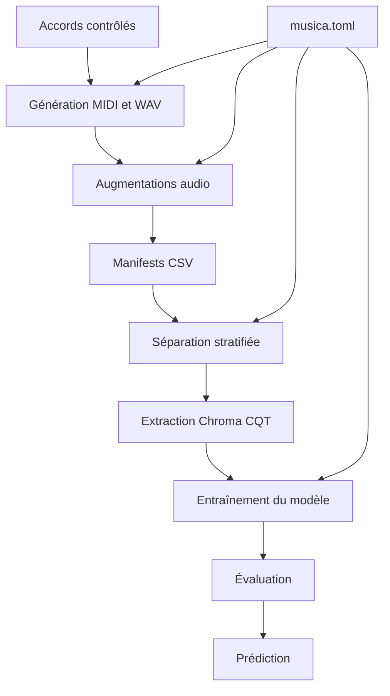
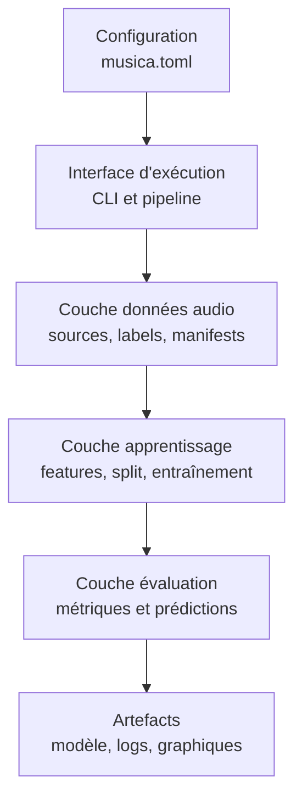
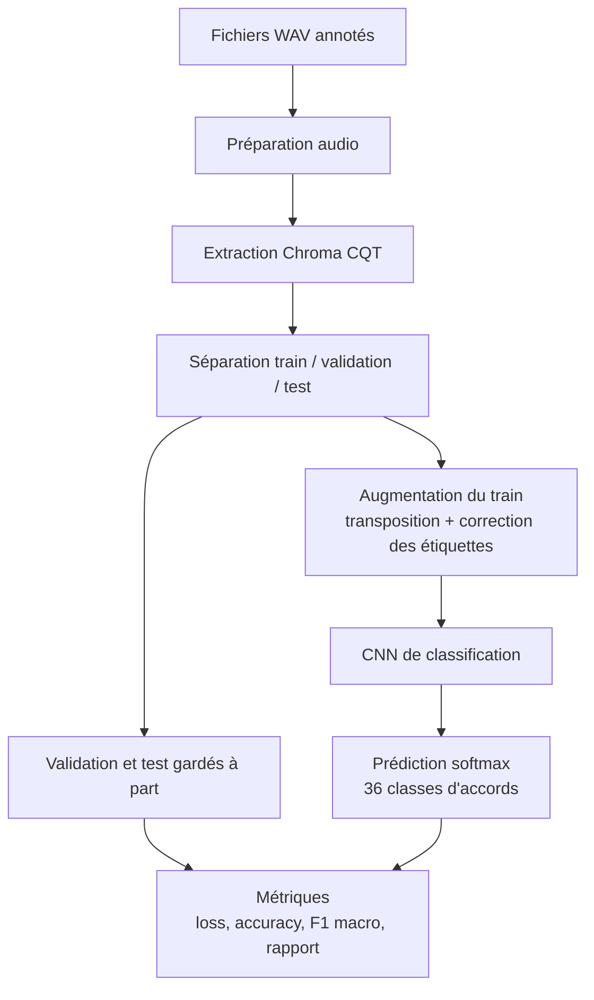

# Musica

Musica est un projet d’intelligence artificielle appliquée à l’audio. L’objectif
est de reconnaître automatiquement des accords à partir de fichiers WAV courts.
Le projet couvre toute la chaîne de travail : création du jeu de données,
augmentation audio, extraction de caractéristiques musicales, entraînement d’un
modèle de classification et analyse des résultats.

Ce document sert de guide pour comprendre le projet, sa méthode, son jeu de
données, son architecture, ses résultats d’essai et ses limites actuelles.

## Sommaire

* [Objectif](#objectif)
* [Méthode générale](#méthode-générale)
* [Jeu de données](#jeu-de-données)
* [Architecture logicielle](#architecture-logicielle)
* [Architecture du modèle](#architecture-du-modèle)
* [Résultats d’essai](#résultats-dessai)
* [Problèmes rencontrés](#problèmes-rencontrés)
* [Installation et commandes](#installation-et-commandes)
* [Limites et améliorations possibles](#limites-et-améliorations-possibles)

## Objectif

Le problème traité est la classification automatique d’accords musicaux. À partir
d’un fichier audio contenant un accord isolé, le système doit prédire la classe
correspondante, par exemple C_maj, A_min ou F#_dim.

Les objectifs du projet étaient les suivants :

* construire une chaîne complète d’apprentissage automatique audio, depuis la
  donnée brute jusqu’à la prédiction ;
* générer un jeu de données annoté sans dépendre d’une annotation manuelle
  lourde ;
* entraîner un modèle capable de reconnaître les accords à partir de
  caractéristiques audio ;
* garder les essais reproductibles avec une configuration centralisée, des
  manifests, des séparations stables, un cache de modèle et des tests
  automatisés ;
* documenter les choix techniques, les limites et les problèmes rencontrés.

Le prototype reconnaît actuellement 36 classes : les accords majeurs, mineurs et
diminués sur les 12 fondamentales chromatiques.

## Méthode générale

Un modèle de reconnaissance d’accords a besoin de nombreux exemples audio
correctement étiquetés. Comme l’enregistrement et l’annotation manuelle sont
longs, Musica part d’accords générés localement. Les étiquettes sont connues dès
la génération, puis le projet ajoute plusieurs variations pour rendre les données
moins artificielles.

Les principales variations utilisées sont :

* plusieurs instruments ;
* plusieurs octaves ;
* plusieurs vélocités ;
* bruit ajouté ;
* effets audio réalistes ;
* transposition avec mise à jour des étiquettes.

La chaîne de traitement suit ces étapes :

1. Générer des accords MIDI ou WAV avec des étiquettes contrôlées.
2. Enrichir les fichiers propres avec du bruit, des effets réalistes et des
   transpositions.
3. Regrouper les différentes sources audio dans des manifests CSV.
4. Créer une séparation stratifiée entre entraînement, validation et test.
5. Transformer chaque fichier audio en représentation Chroma CQT.
6. Entraîner le modèle CNN sur ces caractéristiques.
7. Évaluer le modèle avec la perte, l’exactitude, le F1 macro et un rapport de
   classification.
8. Produire des prédictions sur un fichier audio exemple.



Le fichier musica.toml centralise les paramètres importants :

* chemins des données et des artefacts ;
* durée audio cible ;
* fréquence d’échantillonnage ;
* ratios de séparation ;
* hyperparamètres du modèle ;
* mécanismes d’arrêt ;
* options d’augmentation.

## Jeu de données

Le jeu de données est organisé dans le dossier audio/chords. Il peut contenir :

* des accords générés proprement ;
* des accords bruités ;
* des variantes plus réalistes ;
* des accords transposés ;
* des enregistrements locaux ajoutés manuellement.

Les classes sont construites avec :

* 12 fondamentales, de C à B ;
* 3 qualités d’accord : majeur, mineur et diminué ;
* 36 classes au total.

Lors de nos essais, nous avons utilisé environ 3 900 fichiers WAV. Ce nombre
n’est pas une valeur fixe du projet : il dépend des fichiers générés, des
augmentations lancées et des données locales disponibles.

La répartition utilisée pendant ces essais était la suivante :

| Séparation | Rôle | Proportion utilisée lors des essais |
| --- | --- | --- |
| Entraînement | Apprendre les motifs audio associés aux accords | environ 70,6 % |
| Validation | Suivre la généralisation pendant l’entraînement | environ 14,7 % |
| Test | Évaluer le modèle sur des fichiers non utilisés pendant l’apprentissage | environ 14,7 % |

<p align="center">
  
</p>

La distribution des classes permet de vérifier que les accords restent équilibrés
entre entraînement, validation et test pendant les essais.

Les enregistrements externes, les fichiers WAV synthétisés et la SoundFont SF2
ne sont pas inclus dans le dépôt, car ils sont trop lourds pour être versionnés.
Le code garde les chemins attendus, mais ces fichiers doivent être téléchargés ou
générés localement.

Jeux de données externes utiles :

* GuitarSet : [page officielle](https://guitarset.weebly.com/) et [téléchargement Zenodo](https://zenodo.org/records/3371780) ;
* MusicNet : [téléchargement Zenodo](https://zenodo.org/records/5120004).

## Architecture logicielle

L’architecture logicielle est organisée autour d’un pipeline de données. Le but
est de garder une séparation claire entre la configuration, la préparation des
données, l’apprentissage du modèle et les artefacts produits. Cette section donne
une vue de haut niveau ; les détails d’implémentation sont volontairement laissés
dans le code.



Les responsabilités sont séparées ainsi :

* la configuration décrit les paramètres reproductibles du projet ;
* l’interface d’exécution lance les scénarios sans porter la logique métier ;
* la couche données prépare les fichiers audio et les étiquettes exploitables ;
* la couche apprentissage transforme ces données en caractéristiques et entraîne
  le modèle ;
* la couche évaluation mesure la performance et produit les sorties utilisées
  pour analyser les essais ;
* les artefacts gardent les résultats réutilisables : modèle entraîné,
  historiques, paramètres et graphiques.

Cette organisation évite que la génération des données, l’entraînement et
l’analyse des résultats soient mélangés dans un même bloc de code. Elle rend
aussi les expériences plus faciles à relancer et à comparer.

## Architecture du modèle

Le modèle traite le problème comme une classification multi-classe : pour chaque
fichier WAV, il doit choisir une classe parmi les 36 accords connus du projet.
L’entrée du réseau n’est pas le signal audio brut. Chaque fichier est d’abord
transformé en caractéristiques Chroma CQT avec librosa.

La préparation d’un exemple suit les étapes suivantes :

1. charger le fichier audio en mono ;
2. le rééchantillonner à la fréquence configurée ;
3. le couper ou le compléter pour obtenir la durée cible ;
4. calculer le Chroma CQT ;
5. convertir le résultat en tenseur `temps x 12 hauteurs x 1 canal`.

Les 12 hauteurs correspondent aux 12 classes de notes chromatiques. Cette
représentation est adaptée au problème, car un accord est principalement défini
par des relations entre hauteurs plutôt que par la forme brute de l’onde audio.

<p align="center">
  
</p>

<p align="center">
  
</p>

Le schéma ci-dessus montre le nombre exact d’éléments représentés par couche.
Pour les couches convolutionnelles, les nœuds représentent les filtres ou cartes
de caractéristiques, pas des neurones denses indépendants. Les cartes gardent
encore une structure temporelle et chromatique interne.

Pendant l’apprentissage, seuls les exemples d’entraînement sont augmentés par
transposition. Le tenseur Chroma CQT est décalé sur l’axe des hauteurs, puis
l’étiquette est recalculée pour conserver la bonne fondamentale. Cette étape
force le modèle à apprendre les relations harmoniques entre notes au lieu de
mémoriser une tonalité particulière.

Les données de validation et de test ne servent pas à apprendre les poids du
modèle. La validation sert à suivre la généralisation pendant l’entraînement. Le
test sert à mesurer la performance finale sur des fichiers gardés à part.

### Détail des couches

Les extraits ci-dessous reprennent les couches construites dans le code
d’entraînement. `input_shape` correspond à la forme d’un exemple Chroma CQT et
`label_count` vaut `36` pour les accords actuellement pris en charge.

#### Entrée

Cette couche déclare la forme attendue par le réseau. Chaque exemple correspond
à un Chroma CQT sous forme de tenseur `temps x 12 hauteurs x 1 canal`; le modèle
ne travaille donc pas directement sur l’onde audio brute.

```python
model = Sequential(name="cnn_chords")
model.add(tf.keras.Input(shape=input_shape))
```

#### Normalisation

La normalisation stabilise les valeurs avant les convolutions. Elle est adaptée
sur les données d’entraînement augmentées, afin que l’échelle des
caractéristiques soit apprise uniquement à partir du train.

```python
normalizer = Normalization(axis=-1)
normalizer.adapt(x_train_aug)
model.add(normalizer)
```

#### Premier bloc convolutionnel

Le premier bloc cherche des motifs qui couvrent toute la dimension chromatique.
Le noyau `3 x 12` observe une courte fenêtre temporelle tout en regardant les
12 hauteurs, ce qui convient bien à la structure d’un accord.

```python
model.add(Conv2D(32, (3, 12), padding="same", kernel_initializer="he_uniform"))
model.add(BatchNormalization())
model.add(Activation("relu"))
model.add(MaxPool2D((2, 1)))
model.add(Dropout(0.10))
```

#### Deuxième bloc convolutionnel

Le deuxième bloc augmente la capacité du modèle avec `64` filtres. Le noyau
`3 x 3` apprend des relations plus locales entre les frames temporelles et les
hauteurs chromatiques.

```python
model.add(Conv2D(64, (3, 3), padding="same", kernel_initializer="he_uniform"))
model.add(BatchNormalization())
model.add(Activation("relu"))
model.add(MaxPool2D((2, 1)))
model.add(Dropout(0.10))
```

#### Troisième bloc convolutionnel

Le troisième bloc conserve `64` filtres pour raffiner les motifs déjà extraits.
Le dropout passe à `0,15`, car le modèle est plus profond à ce stade et le risque
de surapprentissage augmente.

```python
model.add(Conv2D(64, (3, 3), padding="same", kernel_initializer="he_uniform"))
model.add(BatchNormalization())
model.add(Activation("relu"))
model.add(MaxPool2D((2, 1)))
model.add(Dropout(0.15))
```

#### Regroupement global

`GlobalAveragePooling2D` transforme les cartes de caractéristiques en vecteur
compact. Cette étape résume les motifs détectés sans imposer qu’ils apparaissent
à une position temporelle précise.

```python
model.add(GlobalAveragePooling2D())
```

#### Couche dense

La couche dense combine les motifs extraits par les convolutions. Elle contient
`128` neurones avec activation ReLU, initialisation He et régularisation L2 pour
limiter les poids trop grands.

```python
model.add(
    Dense(
        128,
        activation="relu",
        kernel_initializer="he_uniform",
        kernel_regularizer=l2(1e-4),
    )
)
```

#### Dropout final

Ce dropout ignore aléatoirement `25 %` des activations de la couche dense pendant
l’entraînement. Il oblige le modèle à ne pas dépendre d’un petit nombre de
signaux internes.

```python
model.add(Dropout(0.25))
```

#### Sortie

La sortie contient une unité par classe d’accord. L’activation softmax transforme
les scores en probabilités, ce qui permet de choisir l’accord le plus probable
et d’inspecter les alternatives.

```python
model.add(Dense(label_count, activation="softmax"))
```

#### Compilation

La compilation fixe la règle d’apprentissage : Adam optimise la perte de
classification multi-classe, et `accuracy` suit la proportion de prédictions
correctes pendant l’entraînement et la validation.

```python
model.compile(
    optimizer=Adam(learning_rate=0.001),
    loss="sparse_categorical_crossentropy",
    metrics=["accuracy"],
)
```



L’entraînement utilise Adam avec un taux d’apprentissage initial de `0,001`, une
perte `sparse_categorical_crossentropy` et une taille de batch de `32`. Le nombre
maximal d’époques est `60`, mais l’entraînement peut s’arrêter plus tôt si la
perte de validation ne s’améliore plus.

Les garde-fous d’apprentissage sont les suivants :

* arrêt anticipé sur `val_loss`, avec patience `8`, restauration des meilleurs
  poids et amélioration minimale `0,0001` ;
* réduction du taux d’apprentissage sur plateau de validation, facteur `0,3`,
  patience `4`, minimum `0,000001` ;
* sauvegarde automatique du meilleur modèle selon `val_loss` ;
* journal CSV de l’historique d’entraînement ;
* répertoire TensorBoard pour inspecter l’exécution si nécessaire.

## Résultats d’essai

Le pipeline produit des artefacts qui permettent de comparer les expériences et
de vérifier exactement ce qui a été entraîné :

| Artefact | Chemin | Utilité |
| --- | --- | --- |
| Modèle entraîné | `logs/models/<signature>/best_model.keras` | Recharger le meilleur modèle sauvegardé pendant l’entraînement |
| Paramètres | `logs/models/<signature>/params.json` | Garder la configuration, les chemins, les classes et les signatures de données |
| Historique | `logs/models/<signature>/training_log.csv` | Revoir la perte et l’exactitude à chaque époque |
| TensorBoard | `logs/models/<signature>/tensorboard/` | Inspecter l’exécution avec des outils de visualisation |

Cette signature n’est pas écrite en dur dans le README, car elle dépend des
données et des paramètres du moment. Si le jeu de données, les séparations ou les
hyperparamètres changent, une nouvelle signature peut être produite.

Les métriques imprimées par le pipeline sont :

| Métrique | Où elle est calculée | Interprétation |
| --- | --- | --- |
| `loss` | Entraînement et validation, à chaque époque | Erreur optimisée par le réseau. Une baisse indique que le modèle ajuste mieux les exemples. |
| `accuracy` | Entraînement et validation, à chaque époque | Proportion de prédictions correctes. Elle est simple à lire mais peut masquer des classes faibles. |
| `test_loss` | Test final | Perte sur les fichiers jamais utilisés pour apprendre ou régler l’entraînement. |
| `test_accuracy` | Test final | Proportion globale de fichiers test correctement classés. |
| `F1 macro` | Test final | Moyenne du F1 par classe, sans favoriser les classes plus nombreuses. Elle est importante pour vérifier l’équilibre entre accords. |
| Rapport de classification | Test final | Précision, rappel et F1 pour chaque accord. Il sert à repérer les classes problématiques. |

<p align="center">
  
</p>

Les courbes d’entraînement doivent être lues en comparant entraînement et
validation. Une bonne évolution attendue est une baisse de `loss` et une hausse
de `accuracy` sur les deux courbes. Si l’entraînement s’améliore alors que la
validation stagne ou se dégrade, le modèle commence probablement à surapprendre.
Si les deux courbes restent mauvaises, le problème vient plutôt des données, des
caractéristiques, de l’architecture ou des hyperparamètres.

<p align="center">
  
</p>

La matrice de confusion permet de voir quelles classes sont bien reconnues et
quelles classes risquent d’être confondues. Une diagonale marquée indique que le
modèle prédit majoritairement la bonne classe. Les valeurs hors diagonale sont
les erreurs à inspecter en priorité : elles montrent les accords que le modèle
confond, par exemple deux fondamentales proches ou deux qualités d’accord mal
séparées.

Les métriques exactes de test ne sont pas recopiées ici afin d’éviter de figer un
résultat qui pourrait ne plus correspondre au dernier état du jeu de données. Il
faut relancer le scénario d’exécution pour obtenir les valeurs correspondant à
l’état actuel du projet :

```bash
uv run python main.py
```

Le pipeline affiche alors le nombre de fichiers, le nombre de classes, la
signature de l’exécution, `Test accuracy`, `Test loss`, `F1 macro` et le rapport
de classification complet.

## Problèmes rencontrés

Les principaux problèmes rencontrés sont les suivants :

1. Annotation des données : un vrai jeu de données audio annoté aurait demandé
   beaucoup de temps à constituer. La génération contrôlée a permis d’avancer
   plus vite tout en gardant des étiquettes fiables.
2. Réalisme du son : des accords parfaitement propres sont trop éloignés de
   conditions réelles. Le projet ajoute donc du bruit, des effets, plusieurs
   instruments, des octaves différentes, des vélocités variables et une légère
   humanisation.
3. Étiquettes après transposition : quand un fichier audio est transposé, la
   fondamentale change. Le projet doit donc recalculer l’étiquette correctement.
4. Reproductibilité : les résultats deviennent difficiles à comparer si les
   données, les séparations ou les paramètres changent sans trace. Les manifests,
   les graines aléatoires, les signatures d’exécution et les paramètres
   sauvegardés répondent à ce besoin.
5. Dépendances audio : la génération audio dépend parfois de composants externes
   comme FluidSynth et une SoundFont. Le projet prévoit donc un rendu automatique
   capable de revenir à PrettyMIDI si FluidSynth n’est pas disponible.

## Installation et commandes

Installer les dépendances :

```bash
uv sync --extra dev
```

FluidSynth est optionnel. Si FluidSynth et la SoundFont
assets/soundfonts/FluidR3_GM.sf2 sont disponibles, le rendu automatique les
utilise. Sinon, la génération WAV peut passer par PrettyMIDI.

1. Générer des WAV propres :

```bash
uv run musica generate-wav --output-dir audio/chords/clean
```

2. Télécharger des bruits et créer des variantes bruitées :

```bash
uv run musica download-noises --output-dir assets/noises/internet
uv run musica augment-noise --input-dir audio/chords/clean --noise-dir assets/noises/internet --output-dir audio/chords/noisy
```

3. Créer des variantes plus réalistes :

```bash
uv run musica augment-realistic --input-dir audio/chords/clean --output-dir audio/chords/realistic --variants 2
```

4. Transposer les accords et mettre à jour les étiquettes :

```bash
uv run musica augment-transpose --input-dir audio/chords/clean --output-dir audio/chords/transposed --semitones -5,7
```

5. Compiler le manifest global :

```bash
uv run musica build-manifest --output-path audio/manifest.csv
```

6. Lancer le scénario complet de modélisation :

```bash
uv run python main.py
```

7. Lancer les tests :

```bash
uv run pytest
```

## Limites et améliorations possibles

Le projet reste un prototype. Les principales limites sont :

* une grande partie des données est synthétique ;
* la généralisation vers de vrais enregistrements doit encore être validée ;
* les classes sont limitées aux accords majeurs, mineurs et diminués ;
* le modèle ne traite pas encore des morceaux longs avec plusieurs changements
  d’accords.

Les prochaines améliorations seraient d’ajouter davantage d’enregistrements
réels, d’étendre les familles d’accords, de tester une architecture temporelle
plus riche et de produire automatiquement un rapport d’évaluation à chaque
exécution.

## Notice sur l’utilisation de l’IA générative

Une intelligence artificielle générative a été utilisée comme outil d’assistance
pendant le projet, notamment pour aider à structurer la documentation, reformuler
certaines explications, proposer des pistes de correction et accélérer la
relecture. Les choix techniques, l’adaptation au code existant, la validation des
résultats et les tests restent sous responsabilité humaine.
