# Guide pédagogique

Musica essaie de reconnaître l’accord joué dans un court fichier WAV. Le projet
prépare les données, extrait des features Chroma-CQT, entraîne un CNN et garde
les résultats du run pour analyse.

On y trouve les choix du projet : données, pipeline, modèle, résultats et limites
actuelles.

## Sommaire

* [Objectif](#objectif)
* [Méthode générale](#méthode-générale)
* [Jeu de données](#jeu-de-données)
* [Architecture logicielle](#architecture-logicielle)
* [Notebook de démonstration](#notebook-de-démonstration)
* [Architecture du modèle](#architecture-du-modèle)
* [Résultats d’essai](#résultats-dessai)
* [Problèmes rencontrés](#problèmes-rencontrés)
* [Setup de l’environnement](SETUP.md)
* [Limites et améliorations possibles](#limites-et-améliorations-possibles)
* [Notice sur l’utilisation de l’IA générative](#notice-sur-lutilisation-de-lia-générative)

## Objectif

Le problème traité est la classification automatique d’accords musicaux. À partir
d’un fichier audio contenant un accord isolé, le système doit prédire la classe
correspondante, par exemple C_maj, A_min ou F#_dim.

Les objectifs du projet :

* construire un pipeline audio complet, depuis la donnée brute jusqu’à la
  prédiction ;
* générer un jeu de données annoté sans dépendre d’une annotation manuelle
  lourde ;
* entraîner un modèle capable de reconnaître les accords à partir de
  caractéristiques audio ;
* garder les essais reproductibles avec une configuration centralisée, des
  manifests, des séparations stables, des caches de features et de modèle et des tests
  automatisés ;
* documenter les choix techniques, les limites et les problèmes rencontrés.

Le prototype reconnaît actuellement 36 classes : les accords majeurs, mineurs et
diminués sur les 12 fondamentales chromatiques.

## Méthode générale

Un modèle de reconnaissance d’accords a besoin de nombreux exemples audio
correctement étiquetés. Comme l’enregistrement et l’annotation manuelle sont
longs, Musica part d’accords générés localement. Les étiquettes sont connues dès
la génération, puis le projet ajoute plusieurs variations pour rendre les données
moins artificielles.

Les principales variations utilisées sont :

* plusieurs instruments ;
* plusieurs octaves ;
* plusieurs vélocités ;
* bruit ajouté ;
* effets audio réalistes ;
* transposition avec mise à jour des étiquettes.

La chaîne de traitement suit ces étapes :

1. Générer des accords MIDI ou WAV avec des étiquettes contrôlées.
2. Enrichir les fichiers propres avec du bruit, des effets réalistes et des
   transpositions.
3. Regrouper les différentes sources audio dans des manifests CSV.
4. Créer une séparation stratifiée entre entraînement, validation et test.
5. Transformer chaque fichier audio en représentation Chroma CQT.
6. Entraîner le modèle CNN sur ces caractéristiques.
7. Évaluer le modèle avec la perte, l’exactitude, le F1 macro et un rapport de
   classification.
8. Produire des prédictions sur un fichier audio exemple.

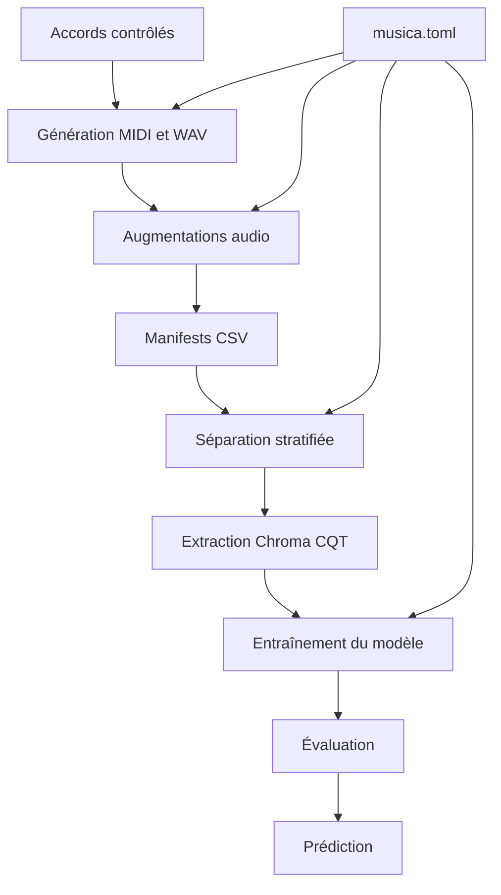

Le fichier `musica.toml` centralise les paramètres importants :

* emplacements des données et artefacts, rangés avec la fonctionnalité qui les utilise ;
* durée audio cible ;
* fréquence d’échantillonnage ;
* ratios de séparation ;
* hyperparamètres du modèle ;
* mécanismes d’arrêt ;
* options d’augmentation.

## Jeu de données

Le jeu de données est organisé dans le dossier `audio/chords`. Il peut contenir :

* des accords générés proprement ;
* des accords bruités ;
* des variantes plus réalistes ;
* des accords transposés ;
* des enregistrements locaux ajoutés manuellement.

Les classes sont construites avec :

* 12 fondamentales, de C à B ;
* 3 qualités d’accord : majeur, mineur et diminué ;
* 36 classes au total.

Lors du dernier run inspecté, le scénario de modélisation a utilisé 3 924
fichiers WAV : 972 fichiers propres, 972 fichiers bruités, 1 944 variantes
réalistes et 36 enregistrements locaux. Ce nombre n’est pas une valeur fixe du
projet : il dépend des fichiers générés, des augmentations lancées et des
données locales disponibles.

La répartition utilisée pendant ce run par `uv run python main.py` était la
suivante :

| Séparation   | Rôle                                                                    | Fichiers |     Proportion |
|--------------|-------------------------------------------------------------------------|---------:|---------------:|
| Entraînement | Apprendre les motifs audio associés aux accords                         |    2 772 | environ 70,6 % |
| Validation   | Suivre la généralisation pendant l’entraînement                         |      576 | environ 14,7 % |
| Test         | Évaluer le modèle sur des fichiers non utilisés pendant l’apprentissage |      576 | environ 14,7 % |

Cette répartition correspond au split stratifié de modélisation, configuré par
`val_ratio = 0.15` et `test_ratio = 0.15` dans `musica.toml`. Elle est différente
du manifest global produit par `uv run musica build-manifest`, qui écrit
`audio/manifest.csv` avec les ratios `80/10/10` configurés dans la section
`[manifest]`.

<p align="center">
  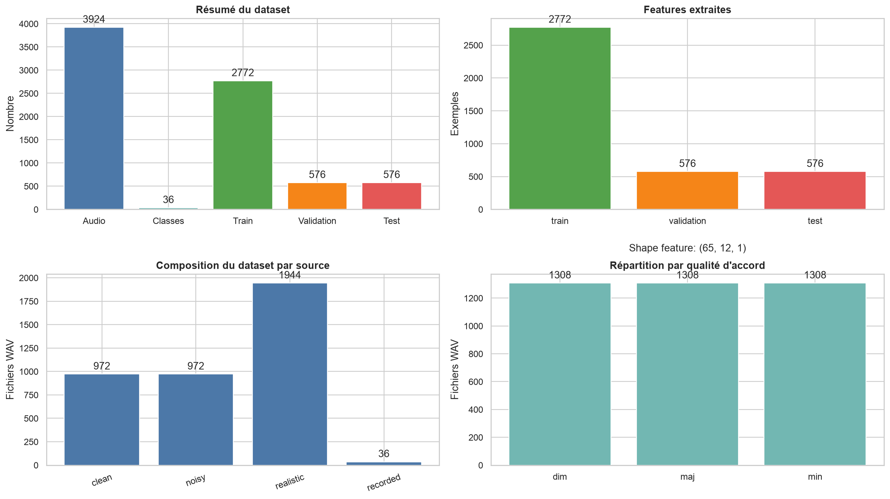
</p>

<p align="center">
  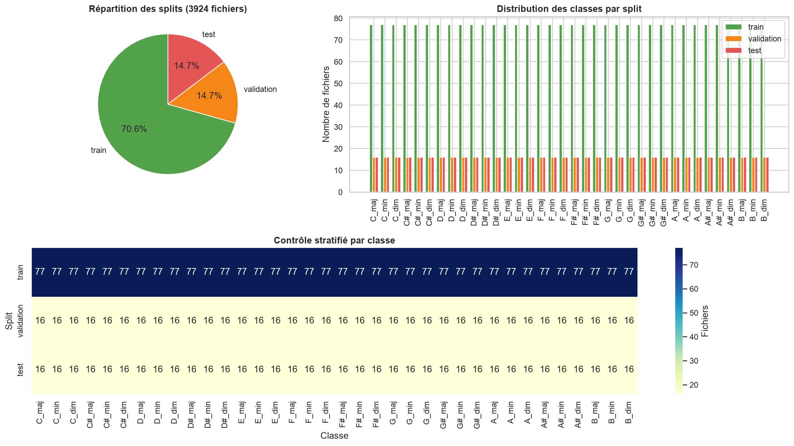
</p>

Ces graphiques permettent de vérifier le volume du dataset, la provenance des
fichiers audio, la répartition des qualités d’accord et l’équilibre des classes
entre entraînement, validation et test.

Les enregistrements externes, les fichiers WAV synthétisés et la SoundFont SF2
ne sont pas inclus dans le dépôt, car ils sont trop lourds pour être versionnés.
Le code garde les chemins attendus, mais ces fichiers doivent être téléchargés ou
générés localement.

Jeux de données externes utiles :

* GuitarSet : [page officielle](https://guitarset.weebly.com/)
  et [téléchargement Zenodo](https://zenodo.org/records/3371780) ;
* MusicNet : [téléchargement Zenodo](https://zenodo.org/records/5120004).

## Architecture logicielle

L’architecture logicielle est organisée autour d’un pipeline de données. Le but
est de garder une séparation claire entre la configuration, la préparation des
données, l’apprentissage du modèle et les artefacts produits. Cette section donne
une vue de haut niveau ; les détails d’implémentation sont volontairement laissés
dans le code.

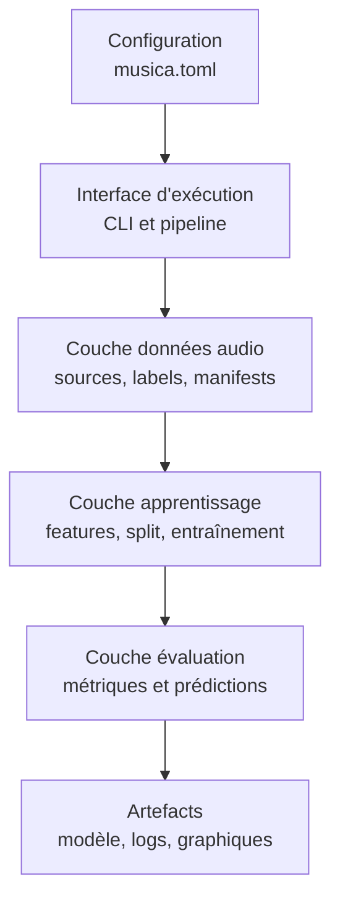

Les responsabilités sont séparées ainsi :

* la configuration décrit les paramètres reproductibles du projet ;
* l’interface d’exécution lance les scénarios sans porter la logique métier ;
* la couche données prépare les fichiers audio et les étiquettes exploitables ;
* la couche apprentissage transforme ces données en caractéristiques et entraîne
  le modèle ;
* la couche évaluation mesure la performance et produit les sorties utilisées
  pour analyser les essais ;
* les artefacts gardent les résultats réutilisables : modèle entraîné,
  historiques, paramètres et graphiques.

Cette organisation évite que la génération des données, l’entraînement et
l’analyse des résultats soient mélangés dans un même bloc de code. Elle rend
aussi les expériences plus faciles à relancer et à comparer.

## Notebook de démonstration

Le notebook `musica.ipynb` présente le run de bout en bout. Les cellules restent
courtes, les graphiques montrent les points importants et les fonctions de
support vivent dans `notebook_helpers.py`.

Étapes du notebook :

1. chargement de la configuration `musica.toml` ;
2. préparation des données avec split stratifié ;
3. audit du dataset par source, qualité d’accord et séparation ;
4. visualisation d’un signal audio et de sa feature Chroma CQT ;
5. réutilisation du cache de features, puis chargement du modèle en cache ou entraînement si le cache est absent ;
6. affichage de l’architecture du modèle avec `model.summary()` ;
7. courbes d’entraînement, loss, accuracy et learning rate ;
8. métriques de test, matrice de confusion normalisée et analyse des erreurs ;
9. rapport de classification sous forme de DataFrame ;
10. prédictions top-k sur les fichiers du dossier `examples/`.

Le helper `notebook_helpers.py` centralise les fonctions de visualisation et
d’analyse utilisées par le notebook : tableaux, graphiques du dataset, courbes
d’entraînement, matrice de confusion, DataFrame du rapport de classification et
graphiques de prédiction.

Les principaux graphiques exportés depuis le notebook sont versionnés dans
`images/` :

| Graphique       | Fichier                                          | Ce qu’il montre                                                          |
|-----------------|--------------------------------------------------|--------------------------------------------------------------------------|
| Vue dataset     | `images/notebook-dataset-overview.png`      | Volume global, features extraites, sources audio et qualités d’accord    |
| Splits          | `images/notebook-split-distribution.png`    | Répartition train/validation/test et contrôle stratifié par classe       |
| Audio + feature | `images/notebook-audio-chroma.png`          | Onde audio d’un exemple et représentation Chroma CQT utilisée par le CNN |
| Courbes         | `images/notebook-training-curves.png`       | Accuracy, loss et learning rate du run                                   |
| Évaluation      | `images/notebook-test-metrics.png`          | Accuracy, F1 macro et loss sur le test                                   |
| Confusion       | `images/notebook-confusion-normalized.png`  | Matrice de confusion normalisée                                          |
| Rapport         | `images/notebook-classification-report.png` | Rapport de classification sous forme de tableau                          |
| Erreurs         | `images/notebook-error-analysis.png`        | Classes les plus faibles et principales confusions                       |
| Prédictions     | `images/notebook-example-predictions.png`   | Top-k sur les fichiers WAV du dossier `examples/`                        |

<p align="center">
  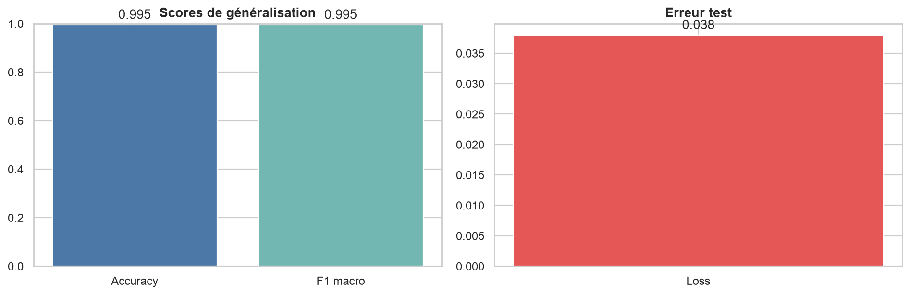
</p>

<p align="center">
  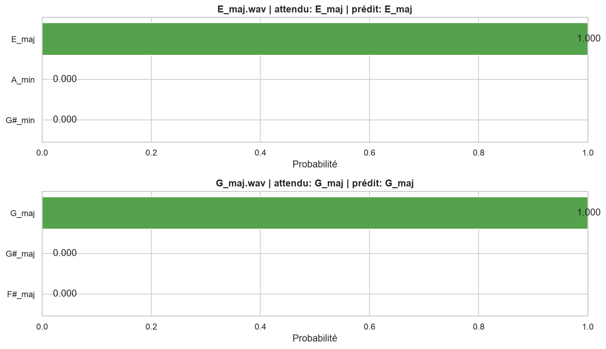
</p>

Pour ouvrir le notebook avec les dépendances du projet, il faut utiliser le
kernel Python de l’environnement `uv`. Une option pratique est d’enregistrer ce
kernel, puis d’ouvrir `musica.ipynb` dans Jupyter :

```bash
uv run python -m ipykernel install --user --name musica --display-name "Musica"
jupyter lab musica.ipynb
```

Si un environnement Jupyter est déjà configuré, il suffit de sélectionner le
kernel `Musica` ou le Python de `.venv`. L’exécution du notebook réutilise le
cache de features dans `logs/features` et le cache modèle dans `logs/models`
tant que les fichiers audio, les splits et les paramètres ne changent pas. Ces
emplacements viennent de `feature_cache_dir` dans `[features]` et de `logs_dir`
dans `[training]`.

## Architecture du modèle

Le modèle traite le problème comme une classification multi-classe : pour chaque
fichier WAV, il doit choisir une classe parmi les 36 accords connus du projet.
L’entrée du réseau n’est pas le signal audio brut. Chaque fichier est d’abord
transformé en caractéristiques Chroma CQT avec librosa.

La préparation d’un exemple suit les étapes suivantes :

1. charger le fichier audio en mono ;
2. le rééchantillonner à la fréquence configurée ;
3. le couper ou le compléter pour obtenir la durée cible ;
4. calculer le Chroma CQT ;
5. convertir le résultat en tenseur `temps x 12 hauteurs x 1 canal`.

Les 12 hauteurs correspondent aux 12 classes de notes chromatiques. Cette
représentation est adaptée au problème, car un accord est principalement défini
par des relations entre hauteurs plutôt que par la forme brute de l’onde audio.

<p align="center">
  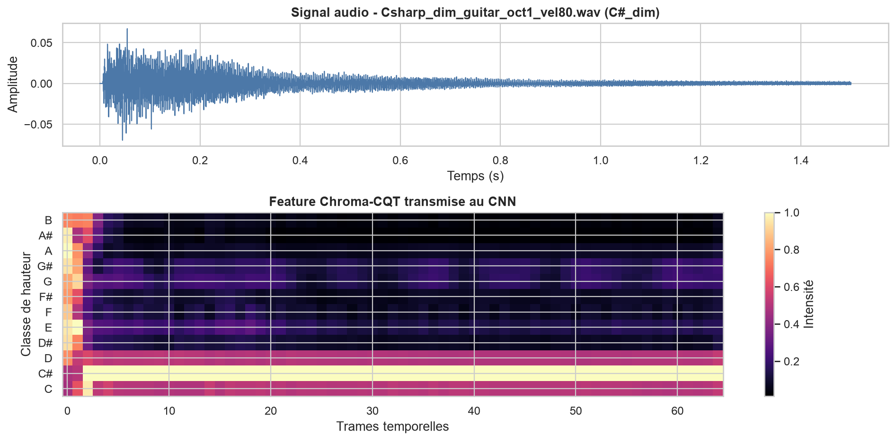
</p>

<p align="center">
  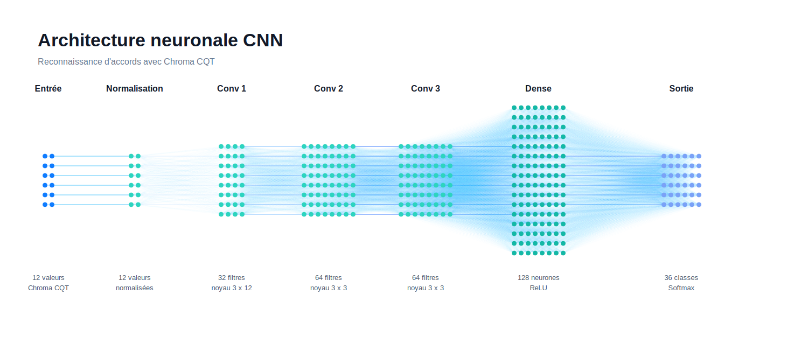
</p>

Le schéma ci-dessus montre le nombre exact d’éléments représentés par couche.
Pour les couches convolutionnelles, les nœuds représentent les filtres ou cartes
de caractéristiques, pas des neurones denses indépendants. Les cartes gardent
encore une structure temporelle et chromatique interne.

Pendant l’apprentissage, seuls les exemples d’entraînement sont augmentés par
transposition. Le tenseur Chroma CQT est décalé sur l’axe des hauteurs, puis
l’étiquette est recalculée pour conserver la bonne fondamentale. Cette étape
force le modèle à apprendre les relations harmoniques entre notes au lieu de
mémoriser une tonalité particulière.

Les données de validation et de test ne servent pas à apprendre les poids du
modèle. La validation sert à suivre la généralisation pendant l’entraînement. Le
test sert à mesurer la performance finale sur des fichiers gardés à part.

### Détail des couches

Les extraits ci-dessous reprennent les couches construites dans le code
d’entraînement. `input_shape` correspond à la forme d’un exemple Chroma CQT et
`label_count` vaut `36` pour les accords actuellement pris en charge.

#### Entrée

Cette couche déclare la forme attendue par le réseau. Chaque exemple correspond
à un Chroma CQT sous forme de tenseur `temps x 12 hauteurs x 1 canal`; le modèle
ne travaille donc pas directement sur l’onde audio brute.

```python
model = Sequential(name="cnn_chords")
model.add(tf.keras.Input(shape=input_shape))
```

#### Normalisation

La normalisation stabilise les valeurs avant les convolutions. Elle est adaptée
sur les données d’entraînement augmentées, afin que l’échelle des
caractéristiques soit apprise uniquement à partir du train.

```python
normalizer = Normalization(axis=-1)
normalizer.adapt(x_train_aug)
model.add(normalizer)
```

#### Premier bloc convolutionnel

Le premier bloc cherche des motifs qui couvrent toute la dimension chromatique.
Le noyau `3 x 12` observe une courte fenêtre temporelle tout en regardant les
12 hauteurs, ce qui convient bien à la structure d’un accord.

```python
model.add(Conv2D(32, (3, 12), padding="same", kernel_initializer="he_uniform"))
model.add(BatchNormalization())
model.add(Activation("relu"))
model.add(MaxPool2D((2, 1)))
model.add(Dropout(0.10))
```

#### Deuxième bloc convolutionnel

Le deuxième bloc augmente la capacité du modèle avec `64` filtres. Le noyau
`3 x 3` apprend des relations plus locales entre les frames temporelles et les
hauteurs chromatiques.

```python
model.add(Conv2D(64, (3, 3), padding="same", kernel_initializer="he_uniform"))
model.add(BatchNormalization())
model.add(Activation("relu"))
model.add(MaxPool2D((2, 1)))
model.add(Dropout(0.10))
```

#### Troisième bloc convolutionnel

Le troisième bloc conserve `64` filtres pour raffiner les motifs déjà extraits.
Le dropout passe à `0,15`, car le modèle est plus profond à ce stade et le risque
de surapprentissage augmente.

```python
model.add(Conv2D(64, (3, 3), padding="same", kernel_initializer="he_uniform"))
model.add(BatchNormalization())
model.add(Activation("relu"))
model.add(MaxPool2D((2, 1)))
model.add(Dropout(0.15))
```

#### Regroupement global

`GlobalAveragePooling2D` transforme les cartes de caractéristiques en vecteur
compact. Cette étape résume les motifs détectés sans imposer qu’ils apparaissent
à une position temporelle précise.

```python
model.add(GlobalAveragePooling2D())
```

#### Couche dense

La couche dense combine les motifs extraits par les convolutions. Elle contient
`128` neurones avec activation ReLU, initialisation He et régularisation L2 pour
limiter les poids trop grands.

```python
model.add(
    Dense(
        128,
        activation="relu",
        kernel_initializer="he_uniform",
        kernel_regularizer=l2(1e-4),
    )
)
```

#### Dropout final

Ce dropout ignore aléatoirement `25 %` des activations de la couche dense pendant
l’entraînement. Il oblige le modèle à ne pas dépendre d’un petit nombre de
signaux internes.

```python
model.add(Dropout(0.25))
```

#### Sortie

La sortie contient une unité par classe d’accord. L’activation softmax transforme
les scores en probabilités, ce qui permet de choisir l’accord le plus probable
et d’inspecter les alternatives.

```python
model.add(Dense(label_count, activation="softmax"))
```

#### Compilation

La compilation fixe la règle d’apprentissage : Adam optimise la perte de
classification multi-classe, et `accuracy` suit la proportion de prédictions
correctes pendant l’entraînement et la validation.

```python
model.compile(
    optimizer=Adam(learning_rate=self.config.learning_rate),
    loss="sparse_categorical_crossentropy",
    metrics=["accuracy"],
)
```

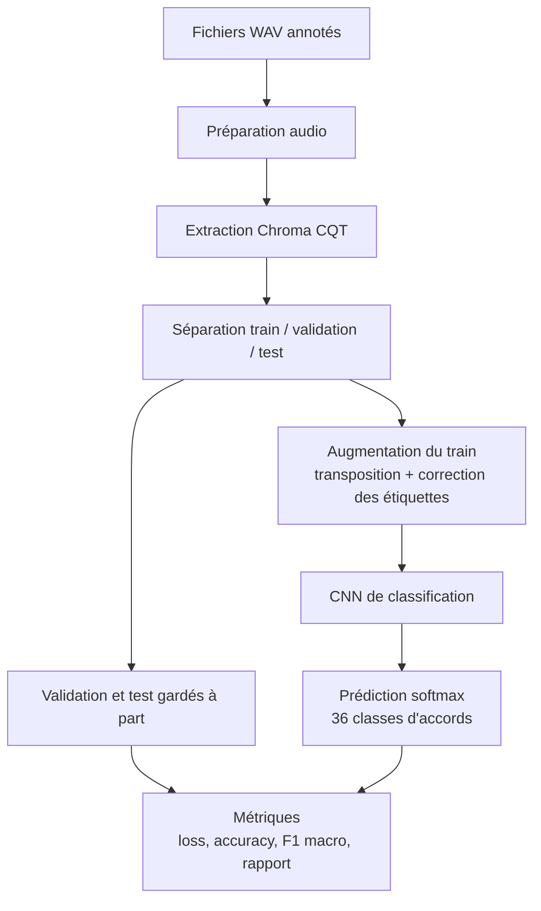

L’entraînement utilise Adam avec le taux d’apprentissage défini dans
`musica.toml` (`0,001` dans la configuration actuelle), une perte
`sparse_categorical_crossentropy` et une taille de batch de `32`. Le nombre
maximal d’époques est `60`, mais l’entraînement peut s’arrêter plus tôt si la
perte de validation ne s’améliore plus.

Les garde-fous d’apprentissage sont les suivants :

* arrêt anticipé sur `val_loss`, avec patience `8`, restauration des meilleurs
  poids et amélioration minimale `0,0001` ;
* réduction du taux d’apprentissage sur plateau de validation, facteur `0,3`,
  patience `4`, minimum `0,000001` ;
* sauvegarde automatique du meilleur modèle selon `val_loss` ;
* journal CSV de l’historique d’entraînement ;
* répertoire TensorBoard pour inspecter l’exécution si nécessaire.

## Résultats d’essai

Le pipeline produit des artefacts qui permettent de comparer les expériences et
de vérifier exactement ce qui a été entraîné :

| Artefact         | Chemin                                     | Utilité                                                                        |
|------------------|--------------------------------------------|--------------------------------------------------------------------------------|
| Modèle entraîné  | `logs/models/<signature>/best_model.keras` | Recharger le meilleur modèle sauvegardé pendant l’entraînement                 |
| Paramètres       | `logs/models/<signature>/params.json`      | Garder la configuration, les chemins, les classes et les signatures de données |
| Historique       | `logs/models/<signature>/training_log.csv` | Revoir la perte et l’exactitude à chaque époque                                |
| TensorBoard      | `logs/models/<signature>/tensorboard/`     | Inspecter l’exécution avec des outils de visualisation                         |
| Notebook         | `musica.ipynb`                             | Lire et rejouer la démonstration complète avec les graphiques inline           |
| Helpers notebook | `notebook_helpers.py`                      | Garder les fonctions d’analyse et d’affichage hors du notebook                 |

Le run inspecté dans le notebook correspond à la signature `bddbd88ac5d1`. Cette
signature dépend des données et des paramètres du moment. Si le jeu de données,
les séparations ou les hyperparamètres changent, une nouvelle signature peut être
produite.

Les métriques imprimées par le pipeline sont :

| Métrique                  | Où elle est calculée                        | Interprétation                                                                                                                     |
|---------------------------|---------------------------------------------|------------------------------------------------------------------------------------------------------------------------------------|
| `loss`                    | Entraînement et validation, à chaque époque | Erreur optimisée par le réseau. Une baisse indique que le modèle ajuste mieux les exemples.                                        |
| `accuracy`                | Entraînement et validation, à chaque époque | Proportion de prédictions correctes. Elle est simple à lire mais peut masquer des classes faibles.                                 |
| `test_loss`               | Test final                                  | Perte sur les fichiers jamais utilisés pour apprendre ou régler l’entraînement.                                                    |
| `test_accuracy`           | Test final                                  | Proportion globale de fichiers test correctement classés.                                                                          |
| `F1 macro`                | Test final                                  | Moyenne du F1 par classe, sans favoriser les classes plus nombreuses. Elle est importante pour vérifier l’équilibre entre accords. |
| Rapport de classification | Test final                                  | Précision, rappel, F1 et support pour chaque accord. Dans le notebook, il est affiché sous forme de DataFrame.                     |

<p align="center">
  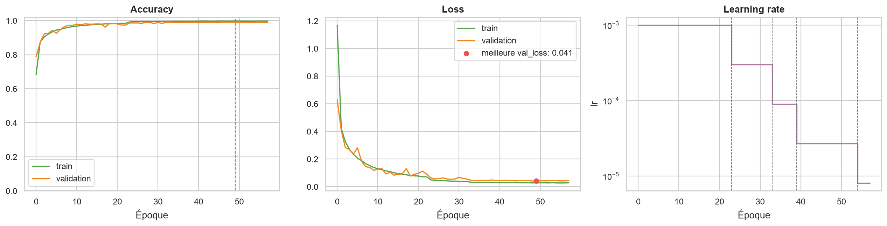
</p>

Les courbes d’entraînement doivent être lues en comparant entraînement et
validation. Une bonne évolution attendue est une baisse de `loss` et une hausse
de `accuracy` sur les deux courbes. Si l’entraînement s’améliore alors que la
validation stagne ou se dégrade, le modèle commence probablement à surapprendre.
Si les deux courbes restent mauvaises, le problème vient plutôt des données, des
caractéristiques, de l’architecture ou des hyperparamètres.

<p align="center">
  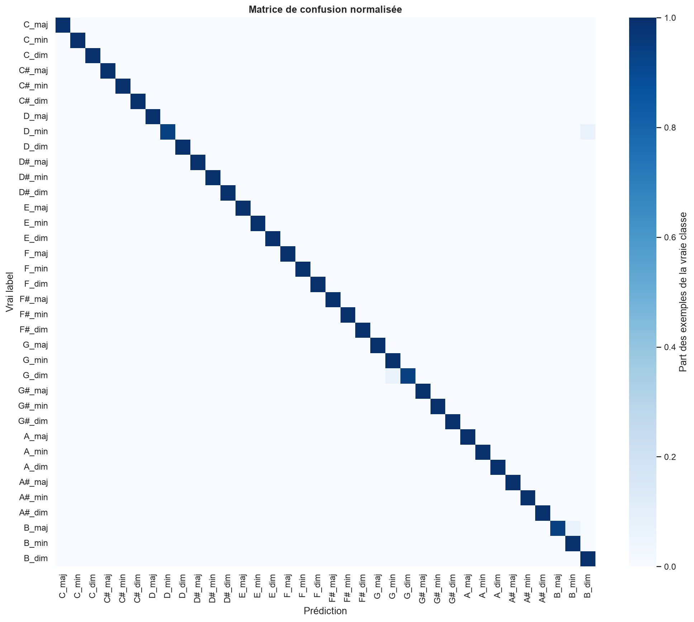
</p>

La matrice de confusion permet de voir quelles classes sont bien reconnues et
quelles classes risquent d’être confondues. Le notebook affiche une matrice
normalisée pour lire les erreurs en proportion de chaque vraie classe, puis un
graphique des confusions les plus importantes. Une diagonale marquée indique que
le modèle prédit majoritairement la bonne classe. Les valeurs hors diagonale sont
les erreurs à inspecter en priorité : elles montrent les accords que le modèle
confond, par exemple deux fondamentales proches ou deux qualités d’accord mal
séparées.

Pour le run `bddbd88ac5d1`, le notebook exécuté sur le split test de 576 exemples
affiche les résultats suivants :

| Métrique test | Valeur |
|---------------|-------:|
| Accuracy      | 0,9948 |
| Loss          | 0,0380 |
| F1 macro      | 0,9948 |

<p align="center">
  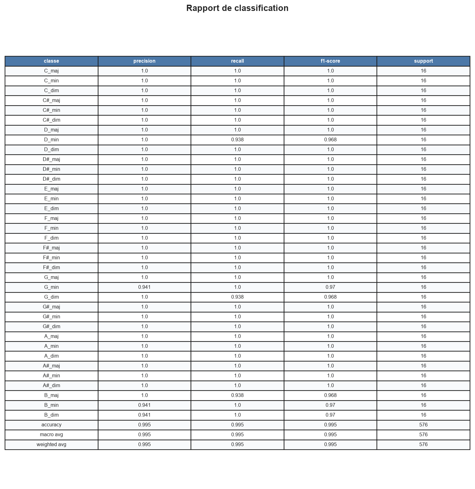
</p>

<p align="center">
  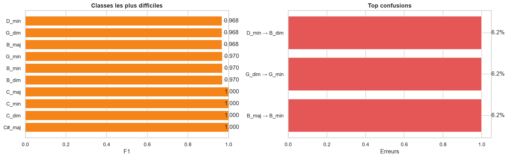
</p>

Ces valeurs décrivent l’état du dataset et des paramètres au moment du run. Il
faut réexécuter le notebook ou le scénario d’entraînement pour obtenir les
valeurs correspondant à un nouvel état du projet :

```bash
uv run python main.py
```

Le pipeline affiche alors le nombre de fichiers, le nombre de classes, la
signature de l’exécution, `Test accuracy`, `Test loss`, `F1 macro` et le rapport
de classification complet. Le notebook ajoute en plus les graphiques de synthèse,
la matrice de confusion normalisée, l’analyse des erreurs et les prédictions
top-k sur les fichiers d’exemple.

## Problèmes rencontrés

Les principaux problèmes rencontrés sont les suivants :

1. Annotation des données : un vrai jeu de données audio annoté aurait demandé
   beaucoup de temps à constituer. La génération contrôlée a permis d’avancer
   plus vite tout en gardant des étiquettes fiables.
2. Réalisme du son : des accords parfaitement propres sont trop éloignés de
   conditions réelles. Le projet ajoute donc du bruit, des effets, plusieurs
   instruments, des octaves différentes, des vélocités variables et une légère
   humanisation.
3. Étiquettes après transposition : quand un fichier audio est transposé, la
   fondamentale change. Le projet doit donc recalculer l’étiquette correctement.
4. Reproductibilité : les résultats deviennent difficiles à comparer si les
   données, les séparations ou les paramètres changent sans trace. Les manifests,
   les graines aléatoires, le cache de features, les signatures d’exécution et
   les paramètres sauvegardés répondent à ce besoin.
5. Dépendances audio : la génération audio dépend parfois de composants externes
   comme FluidSynth et une SoundFont. Le projet prévoit donc un rendu automatique
   capable de revenir à PrettyMIDI si FluidSynth n’est pas disponible.

## Limites et améliorations possibles

Le projet reste un prototype. Les principales limites sont :

* une grande partie des données est synthétique ;
* la généralisation vers de vrais enregistrements doit encore être validée ;
* les classes sont limitées aux accords majeurs, mineurs et diminués ;
* le modèle ne traite pas encore des morceaux longs avec plusieurs changements
  d’accords.

Les prochaines améliorations seraient d’ajouter davantage d’enregistrements
réels, d’étendre les familles d’accords, de tester une architecture temporelle
plus riche et de produire automatiquement un rapport d’évaluation exportable à
partir du notebook.

## Notice sur l’utilisation de l’IA générative

Une intelligence artificielle générative a été utilisée comme outil d’assistance
pendant le projet, notamment pour aider à structurer la documentation, reformuler
certaines explications, proposer des pistes de correction et accélérer la
relecture. Les choix techniques, l’adaptation au code existant, la validation des
résultats et les tests restent sous responsabilité humaine.
